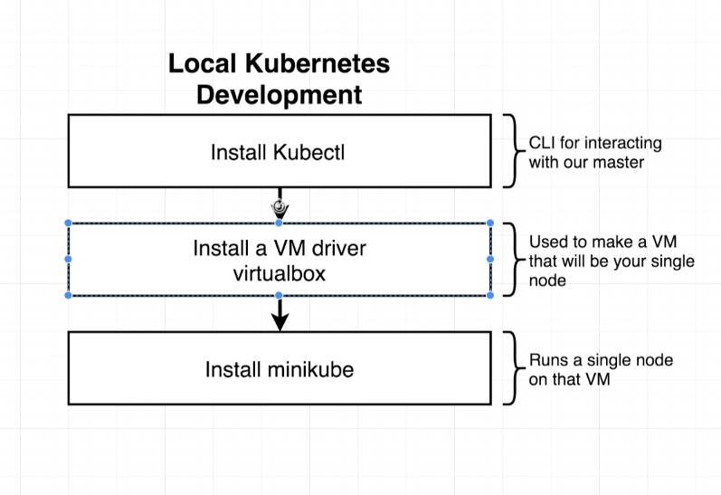

# KUBERNETES FUNDAMENTALS


### Kubernetes is a system to run multiple different containers over multiple different machines
### Kubernetes is used to run many different containers with different images for each container

Kubernetes is effective for scaling applications and having control over them. When we deployed a multiple container architecture using docker, we had this:


So what happens if we need to scale this and require multiple workers to do the heavy lifting?

Elastic Beanstalk's scaling strategy looks like this:


It seems very inefficient to copy multiple nginx, server, and client images and create the same containers that contain all of these instances. It would be way more ideal to multiply just the worker containers, without multiplying nginx, server, or client containers. This is where Kubernetes can come in and orchestrate this architecture so that it copies just the worker containers.

A Kubernetes cluster is an assembly of Master and Nodes. In the image below:
• A `node` is a virtual machine or a physical computer that is used to run a number of containers    
• You can see each `node` can run however number of containers and don't have to be identical to other nodes    
• These `node`s are managed by `Master` that has a set of programs that control what each node is running at a given time.    
• We interact with a Kubernetes cluster via the `Master`, to which we give commands that gives directions to each node    
• Outside of the cluster, we have a load balancer that takes outside traffic and relays the network requests to each of our indvidual nodes    


## Working with Kubernetes in Dev vs Prod
Minikube is a CLI that is meant to setup a small Kubernetes cluster for dev environments on your local computer.

In Production, there are "managed solutions", which are external cloud providers such as AWS or Google Cloud, that will setup your Kubernetes cluster for you and deal with low level tasks. You can also create your own solution, but this is much harder.


## Local Development with Kubernetes
`minikube` is used to create and run the Kubernetes cluster (Virtual Machine) on your local machine that will contain a bunch of containers.
`kubectl` is used to interact with the Kubernetes cluster in general (telling the node what it should do with its containers).



1. Install Kubectl
2. Install VM Driver called `virtualbox`
3. Install minikube

Follow the image below for installation steps:


Once you run `minikube start`, it will automatically access the copy of `VirtualBox` that was installed, setup a virtual machine, and we can configure that machine to behave as a Kuebernetes node.

To check if everything is running as intended run:
`minikube status`
`kubectl cluster-info`

Should show something like this:


## Short term goal: Get the multi-client image running on local Kubernetes Cluster running as a container
Differences between docker and kubernetes.

In Docker, we defined services, and named each service which acted as an entry to represent a container we want to create.
```
services: 
  api: // Entry that gets docker-compose to build image
    build: blah blah // Represents a container to create
    ports: 8080:3000 // We also define port mapping (networking requirements)
```


Really important to deal with manual networking setup in Kubernetes, as it is a BIG topic!!

Our plan right now:


In the upcoming lecture, Stephen will be creating the client-pod.yaml configuration file. You may get a blank page with an error in your console when you attempt to run the pod or deployment in a future lecture:

react-dom.production.min.js:209 TypeError: this.state.seenIndexes.map is not a function

This is because we added the following line to our client/nginx/default.conf file in the earlier Docker lectures:

try_files $uri $uri/ /index.html;

This line was added to resolve some React Router issues our client app was having. However, it will break this demo because we have no Nginx container or Ingress service in place.

The best way to resolve this is to use Stephen's Client image in the pod and deployment for these demos, instead of your own:

image: stephengrider/multi-client

To be clear, this issue will not affect the multi-container Kubernetes project we will be building in Section 14. This is just a quick demo and we will not be reusing these files.

## Adding Configuration files
We are using the `simmonson/multi-client` image that is up on docker hub website.

In the upcoming lecture, Stephen will be creating the client-pod.yaml configuration file. You may get a blank page with an error in your console when you attempt to run the pod or deployment in a future lecture:

react-dom.production.min.js:209 TypeError: this.state.seenIndexes.map is not a function

This is because we added the following line to our client/nginx/default.conf file in the earlier Docker lectures:

try_files $uri $uri/ /index.html;

This line was added to resolve some React Router issues our client app was having. However, it will break this demo because we have no Nginx container or Ingress service in place.

The best way to resolve this is to use Stephen's Client image in the pod and deployment for these demos, instead of your own:

image: stephengrider/multi-client

To be clear, this issue will not affect the multi-container Kubernetes project we will be building in Section 14. This is just a quick demo and we will not be reusing these files.